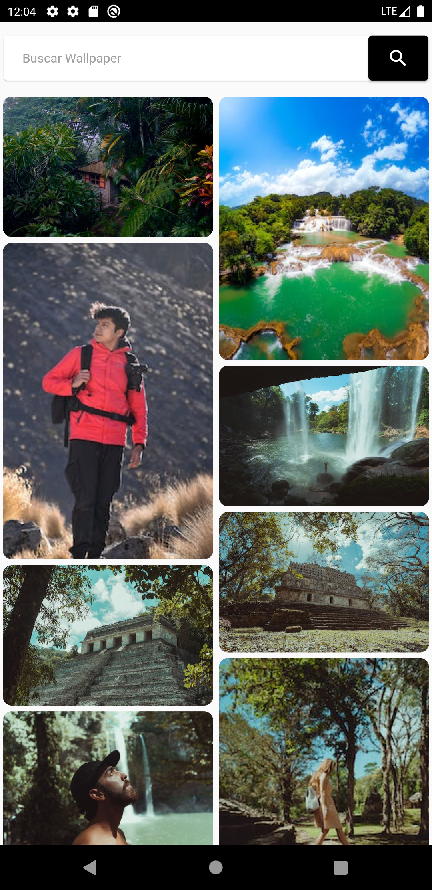
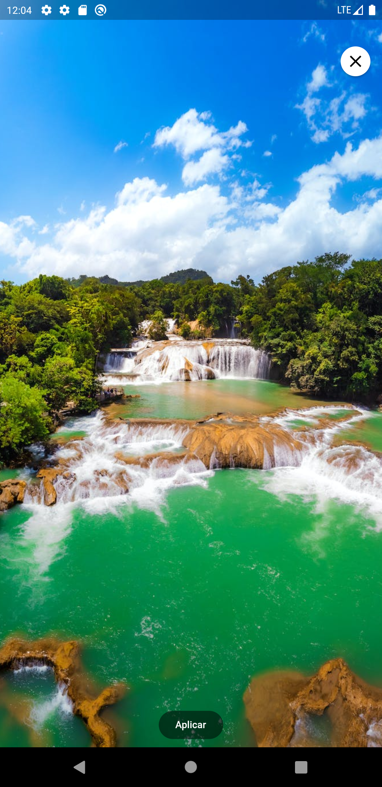
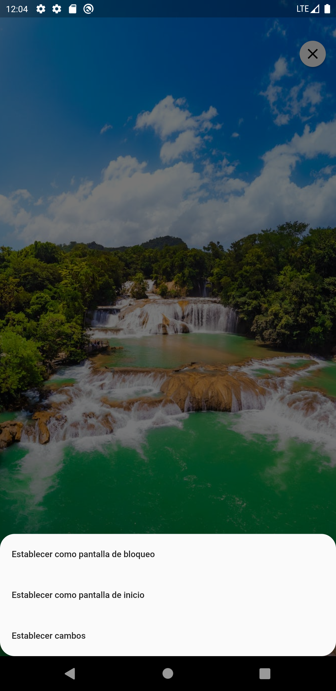

# wallpapers

A new Flutter project.

## Getting Started

## Api consumed using riverpod  and pexels

 <table>
    <thead>
      <tr>
        <th><Strong>Home</Strong></th>
        <th><Strong>Detail</Strong></th>
        <th><Strong>Detail Apply</Strong></th>
      </tr>
    </thead>
    <tbody>
        <tr>
            <td> </td>
           <td> </td>
           <td> </td>
        </tr>
    </tbody>
  </table>